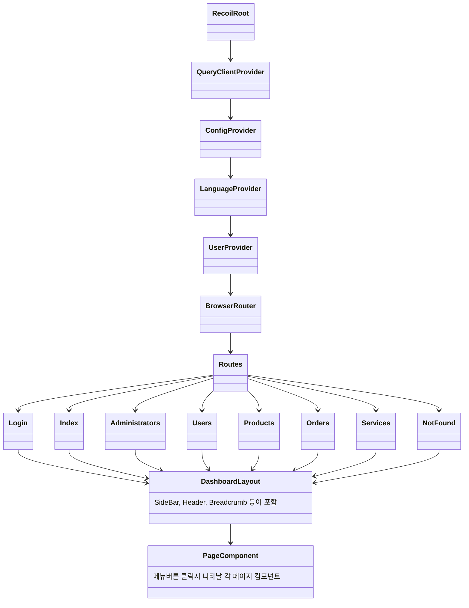

```mermaid
classDiagram
class RecoilRoot
class QueryClientProvider
class ConfigProvider
class LanguageProvider
class UserProvider
class BrowserRouter
class Routes

class Login
class Index
class Administrators
class Users
class Products
class Orders
class Services
class NotFound

class DashboardLayout{SideBar, Header, Breadcrumb 등이 포함}
class PageComponent {메뉴버튼 클릭시 나타날 각 페이지 컴포넌트}


RecoilRoot --> QueryClientProvider
QueryClientProvider --> ConfigProvider
ConfigProvider --> LanguageProvider
LanguageProvider --> UserProvider
UserProvider --> BrowserRouter
BrowserRouter --> Routes

Routes --> Login
Routes --> Index
Routes --> Administrators
Routes --> Users
Routes --> Products
Routes --> Orders
Routes --> Services
Routes --> NotFound

Login --> DashboardLayout
Index --> DashboardLayout
Administrators --> DashboardLayout
Users --> DashboardLayout
Products --> DashboardLayout
Orders --> DashboardLayout
Services --> DashboardLayout
NotFound --> DashboardLayout


DashboardLayout --> PageComponent

```
